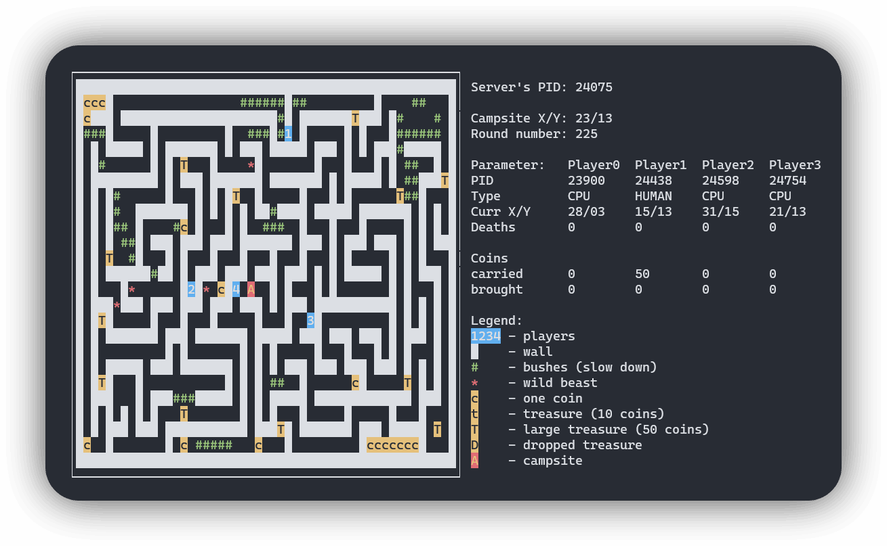

> :warning: **Important information**<br><br>This game was built as a project for an **Operating systems II** university course. If one uses any part of this code in their project, they can expect to have it not be accepted. One of the possible consequences of that action would be a **fail in the course**.<br><br>Please be careful!

<p align="center">
  
</p>

## How to build

To build the game you have to have `ncurses` library installed, and also `make` and `gcc` compiler. You can do this by using the following command
```sh
sudo apt-get install -y libncurses5-dev make gcc
```

To build the game, simply run
```sh
make
```

And then run `server` and `client` programs from build directory

```sh
cd build/
./server
./client
```

<div style="text-align: center">
<b>Made with :purple_heart:</b><br>

## TODO:

- [x] Enemy client
- [x] Bot client
- [x] Bot client - run away from enemy
- [x] Create dropped treasure after player death
- [x] Server - draw players on server view
- [x] Server - fix player info on disconnect
- [x] Server - add key behaviour:
    - [x] B/b – add enemy to random tile
    - [x] c/t/T – add a coin, a treasure or a large treasure
    - [x] Q/q – quit
</div>
